# 						MongoDB入门

## 1. MongoDB简介

### 1.1 什么是MongoDB（NOSQL）

MongoDB 是一个跨平台的，面向文档的数据库，是当前 NoSQL 数据库产品中最热门的一种。它介于关系数据库和非关系数据库之间，是非关系数据库当中功能最丰富，最像关系数据库的产品。它支持的数据结构非常松散，是类似JSON  的 BSON 格式，因此可以存储比较复杂的数据类型。

MongoDB 的官方网站地址是：<http://www.mongodb.org/>

### 1.2 MongoDB特点

MongoDB 最大的特点是他支持的查询语言非常强大，其语法有点类似于面向对象的查询语言，几乎可以实现类似关系数据库单表查询的绝大部分功能，而且还支持对数据建立索引。它是一个面向集合的,模式自由的文档型数据库。

具体特点总结如下：

（1）面向集合存储，易于存储对象类型的数据

（2）模式自由

（3）支持动态查询

（4）支持完全索引，包含内部对象

（5）支持复制和故障恢复

（6）使用高效的二进制数据存储，包括大型对象（如视频等）

（7）自动处理碎片，以支持云计算层次的扩展性(MapReduce)

（8）支持 Python，PHP，Ruby，Java，C，C#，Javascript，Perl 及 C++语言的驱动程序，社区中也提供了对 Erlang 及.NET 等平台的驱动程序

（9）文件存储格式为BSON（一种 JSON 的扩展）

### 1.3 MongoDB体系结构

MongoDB 的逻辑结构是一种层次结构。主要由：

文档(document)、集合(collection)、数据库(database)这三部分组成的。逻辑结构是面向用户

的，用户使用 MongoDB 开发应用程序使用的就是逻辑结构。

（1）MongoDB 的文档（document），相当于关系数据库中的一行记录。

（2）多个文档组成一个集合（collection），相当于关系数据库的表。

（3）多个集合（collection），逻辑上组织在一起，就是数据库（database）。

（4）一个 MongoDB 实例支持多个数据库（database）。

文档(document)、集合(collection)、数据库(database)的层次结构如下图


下表是MongoDB与MySQL数据库逻辑结构概念的对比

| MongoDb           | 关系型数据库Mysql |
| ----------------- | ----------------- |
| 数据库(databases) | 数据库(databases) |
| 集合(collections) | 表(table)         |
| 文档(document)    | 行(row)           |

## 2.安装与启动
### 2.1 安装设置

双击“资源”中的“mongodb-win32-x86_64-2008plus-ssl-4.0.8-signed.msi” 

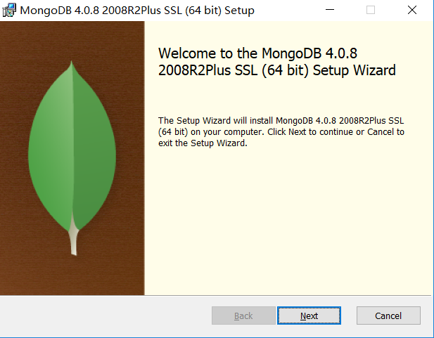

按照提示步骤安装即可。安装完成后，软件会安装在C:\Program Files\MongoDB 目录中。

我们要启动的服务程序就是

C:\Program Files\MongoDB\Server\4.0.8\bin

目录下的mongod.exe，为了方便我们每次启动，我将

C:\Program Files\MongoDB\Server\4.0.8\bin 设置到**环境变量**path中。

### 2.2 启动服务

（1）首先打开命令提示符，创建一个用于存放数据的目录

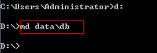

（2）启动服务


dbpath参数用于指定数据存储目录

启动后效果如下：

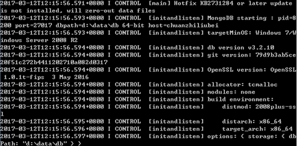

我们在启动信息中可以看到，mongoDB的默认端口是27017

   

如果我们不想按照默认端口启动，可以通过--port 命令来修改端口

   

客户端工具:


### 2.3 登录系统

我们另外打开命令提示符窗口，如果mongoDB是按默认的端口启动的，并且是部署在本机的。输入命令 mongo 即可登陆系统 

   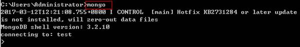

从界面输出的信息我们可以得知，它默认连接的是test数据库

如果是要连接远程的mongoDB服务器 ，就输入命令

```
mongo 远程IP地址
```

如果远程的mongoDB服务端口不是默认的，需要输入命令  

```
mongo 远程IP地址:端口
```

输入exit命令可退回到命令提示符

### 2.4 mongodb实现远程连接

1. 添加管理员账户（https://docs.mongodb.com/guides/server/auth/）

```
use admin;

db.createUser(
  {
    user: "gerry",
    pwd: "gerry",
    roles: [ { role: "userAdminAnyDatabase", db: "admin" } ]
  }
);
```

2. 配置mongodb.conf 

```
bind_ip=0.0.0.0
port=27017
dbpath=/root/mongodb-linux-x86_64-4.0.8/data/db
logpath=/root/mongodb-linux-x86_64-4.0.8/data/log/mongo.log
auth=true #开启权限认证
## --fork 后台启动 必须指定日志文件
```

3. 启动方式 ./mongod -f mongodb.conf  --fork
4. 重启mongodb

```
## 关闭mongodb
./mongod -shutdown --dbpath=/usr/local/mongodb/data 

/etc/init.d/mongod


```

4. 防火墙开放27017端口

```
firewall-cmd --add-port=27017 --permanent
```

## 3. 数据库的CURD操作
### 3.1 选择/创建数据库

使用use 数据库名称即可选择数据库，如果该数据库不存在会自动创建

```
use testdb;
```

### 3.2 插入文档

文档相当于关系数据库中的记录

首先我们定义一个文档变量，格式为变量名称={}; 例如：

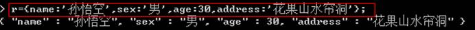

接下来就是将这个变量存入MongoDB 

格式为：

```
db.集合名称.save(变量);
```

这里的集合就相当于关系数据库中的表。例如：


这样就在testCollection集合中存入文档。如果这个testCollection集合不存在，就会自动创建。

当然，你也可以不用定义变量，直接把变量值放入save方法中也是可以地。

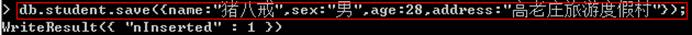

为了方便后期测试，我们再多加点数据

```
db.testCollection.save({name:"沙和尚",sex:"男",age:25,address:"流沙河路11号"});
db.testCollection.save({name:"唐僧",sex:"男",age:35,address:"东土大唐"});
db.testCollection.save({name:"白骨精",sex:"女",age:18,address:"白骨洞"});
db.testCollection.save({name:"白龙马",sex:"男",age:20,address:"西海"});
db.testCollection.save({name:"哪吒",sex:"男",age:15,address:"莲花湾小区"});
```

### 3.3 查询集合

我们要查询某集合的所有文档，使用find()方法。语法格式为：

```
db.集合名称.find();
```

例如，我们要查询testCollection集合中的所有文档：

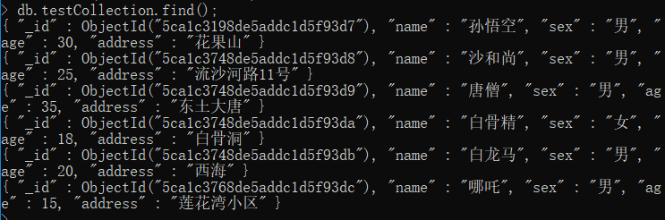

这里你会发现每条文档会有一个叫_id的字段，这个相当于我们原来关系数据库中表的主键，当你在插入文档记录时没有指定该字段，MongDB会自动创建，其类型是ObjectID类型。

如果我们在插入文档记录时指定该字段也可以，其类型可以使ObjectID类型，也可以是MongoDB支持的任意类型. 例如：

```
db.testCollection.save({_id:1,name:"红孩儿",sex:"男",age:15,address:"火云洞"});
```

如果我想按一定条件来查询，比如我想查询性别为“女”的记录，怎么办？很简单！

只要在find()中添加参数即可，参数也是json

格式，如下：

```
db.testCollection.save({sex:"男"});
```

为了避免游标可能带来的开销，MongoDB还提供了一个叫findOne()的方法，用来返回结果集的第一条记录。

```
db.testCollection.findOne({sex:"男"});
```

性别为男的有很多条，这里只返回了第一条记录。

当我们需要返回查询结果的前几条记录时，可以使用limit方法，例如：

```
db.testCollection.find().limit(2);
```

### 3.4 修改文档

我们要想修改记录，可以使用update方法 .

例如：我向将姓名为孙悟空的学员文档中的age字段值改为31，执行下列语句，看会发生什么？

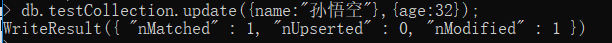

我们在执行查询

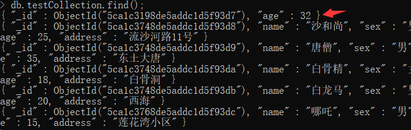

哦，悲剧了~~ 原来的孙悟空的文档只剩下_id 和age两个字段了。

那如何保留其它字段值呢？

我们需要使用MongoDB提供的修改器$set 来实现，请看下列代码。

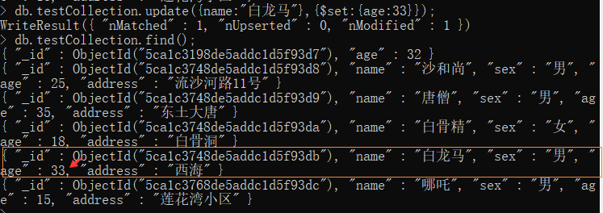

再次查询，会发现“白龙马”文档中原有的其它字段还保留下来，而更新age字段也成功了。

### 3.5 删除文档

删除文档使用remove()方法，格式为：

```
db.集合名称.remove(条件);
```

请慎用remove({}), 它会一条不剩地把你的集合所有文档删的干干净净。

现在演示一下，删除name为“唐僧”的记录：

```
db.testCollection.remove({name:"唐僧"});
```

## 4.高级查询
### 4.1 模糊查询

MongoDB的模糊查询是通过正则表达式的方式实现的。格式为：

  /模糊查询字符串/

例如，我要查询testCollection集合中address字段中含有“洞”的所有文档，代码如下

```
db.testCollection.find({address:/洞/});   #包含洞字的记录
db.testCollection.find({name:/^唐/});     #查询姓唐的记录
db.testCollection.find({address:/区$/});  #查询以区结尾的地址
db.testCollection.find({name:/mm/i});     #包含mm字符的忽略大小写匹配
```

### 4.2 Null值查询

如果我们想找出集合中某字段值为空的文档，如何查询呢？其实和我们之前的条件查询是一样的，条件值写为null就可以了。

我们现在集合中的文档都是没有空值的，为了方便测试，现在我们将数据做些修改：

将“沙和尚”的address改为空

```
db.testCollection.update({name:"沙和尚"},{$set:{address:null}});
```

在执行条件查询

```
db.testCollection.find({address:null});
```

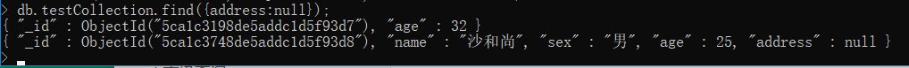

会发现不仅会显示“唐僧”这条文档，之前因为修改导致address字段丢失的那条记录也出现了。也就是说，这种查询会查询出该字段为null的以及不存在该字段的文档记录。

### 4.3 大于小于

<, <=, >, >= 这个操作符也是很常用的，格式如下

```
db.testCollection.find({ "field" : { $gt: value } } ); // 大于: field > value
db.testCollection.find({ "field" : { $lt: value } } ); // 小于: field < value
db.testCollection.find({ "field" : { $gte: value } } ); // 大于等于: field >= value
db.testCollection.find({ "field" : { $lte: value } } ); // 小于等于: field <= value
```

示例：查询年龄大于等于20岁的学员记录

```
db.testCollection.find({age:{$gte:20}});
```

### 4.4 不等于

不等于使用$ne操作符。

示例：查询sex字段不为“男”的文档

```
db.testCollection.find({sex:{$ne:"男"}});
```

### 4.5 判断字段是否存在

判断字段是否存在使用$exists操作符。

示例：查询所有含有address字符的文档。

```
db.testCollection.find({address:{$exists:true}});
```

示例：查询所有不含有address字符的文档。

```
db.testCollection.find({address:{$exists:false}});
```

### 4.6 包含与不包含

包含使用$in操作符。

示例：查询testCollection集合中age字段包含20,25,30的文档

```
db.testCollection.find({age:{$in:[20,25,30]}});
```

示例：查询testCollection集合中age字段不包含20,25,30的文档

```
db.testCollection.find({age:{$nin:[20,25,30]}});
```

### 4.7 统计记录条数

统计记录条件使用count()方法。

示例：查询testCollection集合的文档条数。

```
db.testCollection.count();
```

示例：查询testCollection集合中age字段小于等于20的文档条数。

```
db.testCollection.count({age:{$lte:20}});
```

### 4.8 条件连接--并且

我们如果需要查询同时满足两个以上条件，需要使用$and操作符将条件进行关联。（相当于SQL的and）

格式为：$and:[ {  },{  },{   } ]

示例：查询testCollection集合中age大于等于20 并且age小于30的文档

```
db.testCollection.find({$and:[{age:{$gte:20}},{age:{$lt:30}}]);
```

### 4.9 条件连接--或者

如果两个以上条件之间是或者的关系，我们使用$or操作符进行关联，与前面$and的使用方式相同

格式为：$or:[ {  },{  },{   } ]

示例：查询testCollection集合中sex为女，或者年龄小于20的文档记录

```
db.testCollection.find({$or:[{sex:女},{age:{$lt:30}}]);
```

## 5. Java连接MongoDB
### 5.1 查询文档
#### 5.1.1 查询全部

（1）创建maven工程mongoDBDemo ，引入依赖。

```xml
<dependencies>
    <dependency>
        <groupId>org.mongodb</groupId>
        <artifactId>mongodb-driver</artifactId>
        <version>3.10.1</version>
    </dependency>
  </dependencies>
```

（2）编写代码，遍历testCollection集合所有数据：

```java
MongoClient client=new MongoClient();//创建连接对象
MongoDatabase database = client.getDatabase("testdb");//获取数据库		
MongoCollection<Document> collection = database.getCollection("testCollection");//获取集合
		
FindIterable<Document> list = collection.find();//获取文档集合
for( Document doc: list){//遍历集合中的文档输出数据
	System.out.println("name:"+ doc.getString("name") );
	System.out.println("sex:"+ doc.getString("sex") );
	System.out.println("age:"+ doc.getDouble("age") );//默认为浮点型
	System.out.println("address:"+ doc.getString("address") );
	System.out.println("--------------------------");
}
```

MongoDB的数字类型默认使用64位浮点型数值。{“x”：3.14}或{“x”：3}。对于整型值，可以使用NumberInt（4字节符号整数），{“x”:NumberInt(“3”)}  或NumberLong（8字节符号整数）{“x”:NumberLong(“3”)}

#### 5.1.2 匹配查询

MongoDB使用BasicDBObject类型封装查询条件，构造方法的参数为key 和value .

示例：查询testCollection集合中name为猪八戒的文档

```java
//构建查询条件
BasicDBObject bson=new BasicDBObject("name", "猪八戒");		
FindIterable<Document> list = collection.find(bson);//获取文档集合
//....遍历集合
```

#### 5.1.3 模糊查询

构建模糊查询条件是通过正则表达式的方式来实现的

（1）完全匹配Pattern pattern = Pattern.compile("^name$");

（2）右匹配Pattern pattern = Pattern.compile("^.*name$");

（3）左匹配Pattern pattern = Pattern.compile("^name.*$");

（4）模糊匹配Pattern pattern = Pattern.compile("^.*name.*$");

示例：模糊查询testCollection集合中address 中含有洞的文档记录

```java
//模糊查询：like %洞%
Pattern queryPattern = Pattern.compile("^.*洞.*$");
BasicDBObject bson=new BasicDBObject("address", queryPattern);	
FindIterable<Document> list = collection.find(bson);//获取文档集合
//....遍历集合
```

#### 5.1.4 大于小于

在MongoDB提示符下条件json字符串为{ age: { $lt :20 } } ，对应的java代码也是BasicDBObject 的嵌套。

示例：查询testCollection集合中age小于20的文档记录

 ```java
//查询年龄小于20的		
BasicDBObject bson=new BasicDBObject("age", new BasicDBObject("$lt",20));
FindIterable<Document> list = collection.find(bson);//获取文档集
//....遍历集合
 ```

#### 5.1.5 条件连接--并且

示例：查询年龄大于等于20并且小于30的文档记录

```java
//查询年龄大于等于20的			
BasicDBObject bson1=new BasicDBObject("age", new BasicDBObject("$gte",20));
//查询年龄小于30的
BasicDBObject bson2=new BasicDBObject("age", new BasicDBObject("$lt",30));
//构建查询条件and
BasicDBObject bson=new  BasicDBObject("$and", Arrays.asList(bson1,bson2)  );
```

#### 5.1.6 条件连接-或者

示例：查询年龄小于等于20或者性别为女的文档记录

```java
BasicDBObject bson1=new BasicDBObject("age", new BasicDBObject("$lte",20));		
BasicDBObject bson2=new BasicDBObject("sex", "女");
//构建查询条件or
BasicDBObject bson=new BasicDBObject("$or", Arrays.asList( bson1, bson2 ) );
```

### 5.2 增加文档

我们使用insertOne方法来插入文档。

示例：添加文档记录--名称：铁扇公主  性别:女 年龄：28   地址：芭蕉洞

```java
//获取连接
MongoClient client=new MongoClient();
//得到数据库
MongoDatabase database = client.getDatabase("testdb");
//得到集合封装对象
MongoCollection<Document> collection = database.getCollection("testCollection");
Map<String, Object> map=new HashMap();
map.put("name", "铁扇公主");
map.put("sex", "女");
map.put("age", 35.0);
map.put("address", "芭蕉洞");		
Document doc=new Document(map);		
collection.insertOne(doc);//插入一条记录
//collection.insertMany(documents);//一次性插入多条文档
```

### 5.3 删除文档

示例：将名称为铁扇公主的文档删除

```java
//获取连接
MongoClient client=new MongoClient();
//得到数据库
MongoDatabase database = client.getDatabase("testdb");
//得到集合封装对象
MongoCollection<Document> collection = database.getCollection("testCollection");
BasicDBObject bson=new BasicDBObject("name", "铁扇公主");
collection.deleteOne(bson);//删除记录（符合条件的第一条记录）
//collection.deleteMany(bson);//删除符合条件的全部记录
```

### 5.4 修改文档

示例：将红孩儿的地址修改为“南海”

```java
//获取连接
MongoClient client=new MongoClient();
//得到数据库
MongoDatabase database = client.getDatabase("testdb");
//得到集合封装对象
MongoCollection<Document> collection = database.getCollection("testCollection");

//修改的条件
BasicDBObject bson= new BasicDBObject("name", "红孩儿");
//修改后的值
BasicDBObject bson2 = new BasicDBObject("$set",new BasicDBObject("address", "南海"));
//参数1：修改条件  参数2：修改后的值
collection.updateOne(bson, bson2);
//collection.updateMany(filter, update);//修改符合条件的所有记录
```

updateMany方法用于修改符合条件的所有记录

updateOne方法用于修改符合条件的第一条记录

## 6. MongoDB连接池

### 6.1 代码实现

MongoClient 被设计为线程安全的类，也就是我们在使用该类时不需要考虑并发的情况，这样我们可以考虑把MongoClient 做成一个静态变量，为所有线程公用，不必每次都销毁。这样可以极大提高执行效率。实际上，这是MongoDB提供的内置的连接池来实现的。

首先我们先创建一个“管理类”，相当于我们原来BaseDao

```java
public class MongoManager {

	private static MongoClient mongoClient=null;
	
	//对mongoClient初始化
	private static void init(){		
		mongoClient=new MongoClient();	
	}
	
	public static MongoDatabase getDatabase(){
		if(mongoClient==null){
			init();
		}		
		return mongoClient.getDatabase("testdb");
	}
}

```

 然后我们创建一个TestDao

```java
public class TestDao {

	public void save(String name,String sex,double age,String address){
		MongoDatabase database = MongoManager.getDatabase();
		MongoCollection<Document> collection = database.getCollection("testCollection");
		Document docment=new Document();
		docment.put("name", name);
		docment.put("sex", sex);		
		docment.put("age", age);
		docment.put("address", address);
		collection.insertOne(docment);
	}	
}
```

现在做个测试，循环插入5万条数据，看看执行时间是多长时间

```java
public static void main(String[] args) {
    long startTime = new Date().getTime();//开始时间

    TestDao testDao=new TestDao();
    for(int i=0;i<20000;i++){
        testDao.save("测试"+i, "女", 25.0, "测试地址"+i);
    }
    long endTime = new Date().getTime();//完成时间
    System.out.println("完成时间："+(endTime-startTime)+"毫秒");
}
```

### 6.2 参数设置

在刚才的代码基础上进行连接池参数的设置

修改MongoManager的init方法

```java
//对mongoClient初始化
private static void init(){
		//连接池选项
		Builder builder = new MongoClientOptions.Builder();//选项构建者	
		builder.connectTimeout(5000);//设置连接超时时间
		builder.socketTimeout(5000);//读取数据的超时时间
		builder.connectionsPerHost(30);//每个地址最大请求数		
		builder.writeConcern(WriteConcern.NORMAL);//写入策略，仅抛出网络异常
		MongoClientOptions options = builder.build();
		mongoClient=new MongoClient("127.0.0.1",options);	
}
```

写入方式有如下策略。

WriteConcern.NONE:没有异常抛出

WriteConcern.NORMAL:仅抛出网络错误异常，没有服务器错误异常

WriteConcern.SAFE:抛出网络错误异常、服务器错误异常；并等待服务器完成写操作。

WriteConcern.MAJORITY: 抛出网络错误异常、服务器错误异常；并等待一个主服务器完成写操作。

WriteConcern.FSYNC_SAFE: 抛出网络错误异常、服务器错误异常；写操作等待服务器将数据刷新到磁盘。

WriteConcern.JOURNAL_SAFE:抛出网络错误异常、服务器错误异常；写操作等待服务器提交到磁盘的日志文件。

WriteConcern.REPLICAS_SAFE:抛出网络错误异常、服务器错误异常；等待至少2台服务器完成写操作。


## 7. MongoDB应用场景

常见应用场景：

1. 就是存log，因为mongodb本身存的就是json，可以很方便的接入各种存储日志的地方。然后可以做成相关监控报表。

2. 其他的话要看题主所在的行业了，不同的行业有不同的用法，比如说信息的展示等等

3. 在网游界，MongoDB也非常流行，比如说最近大火的阴阳师，数据库用的就是MongoD

1. 自带sharding，快速得水平扩展，为存储海量数据带来便捷

2. 官方提供驱动，可以直接对接hadoop或者spark