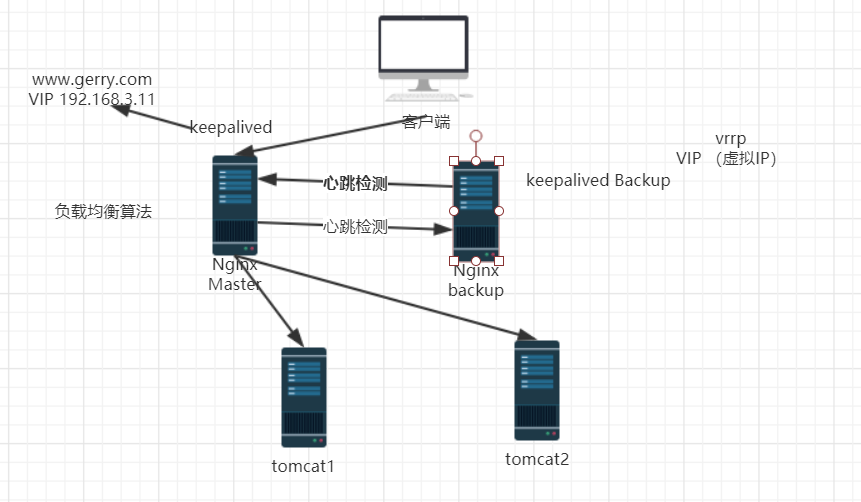
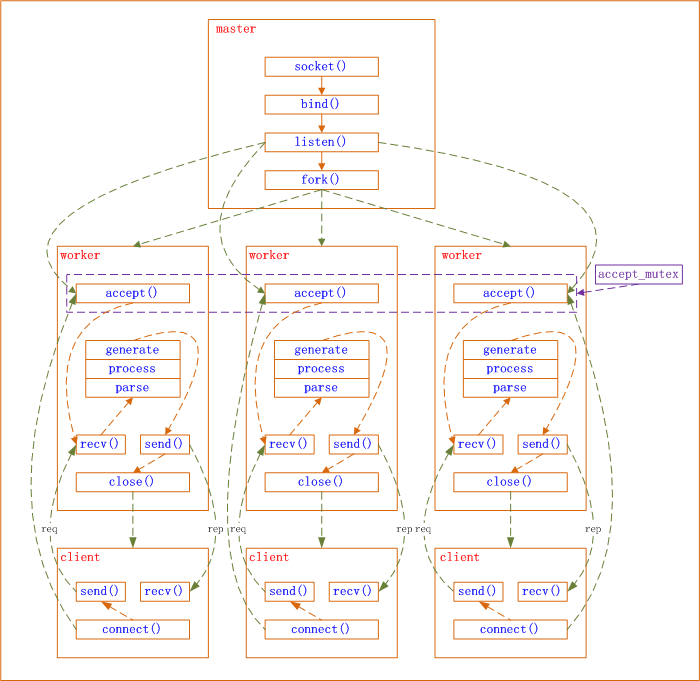

# Nginx的高可用(HA)配置

## 1、高可用配置结构(画图说明)




## 2、KeepAlived的安装和配置

1、安装

```
yum install keepalived
```

2、keepalived.conf配置文件配置

```
global_defs {
    notification_mail {
        ## 指定keepalived在发生切换时需要发送的邮箱
    }
    notification_mail_from xxx@xxx.com #发件人
    #smtp_server xxx.smtp.com
    #smtp_connect_timeout 30
    router_id LVS_MAIN #运行keepalived机器的一个标识
}

vrrp_instance_VI_1 {
    state MASTER # 标识为主为master，备为backup
    interface ens33 #设置实例绑定的网卡
    virtual_router_id 51 # 同一个实例下的virtual_router_id必须相同
    priority 100 # master的权重必须大于backup
    advert_int 1 # master与backup负载均衡器之间同步检测的时间间隔，单位秒
    authentication { #设置认证
        auth_type PASS
        auth_pass 123
    }
    
    virtual_ipaddress { #设置vip
        192.168.3.111
        192.168.3.112 #可以设置多个虚拟IP
    }
}
```

3、启动 /etc/init.d/keepalived start


Session共享问题解决方案:
由于请求先通过Nginx代理服务器,再有nginx服务器分配请求到具体的应用服务器中间就会遇到Session共享问题:

1.ip_hash 根据ip分配请求的应用服务器

2.不使用session,换cookie就不会存在此问题,但是网站安全度降低

3.使用cookie和redis缓存(建议此方案,方便扩展,缓存中速度高效)【会在后面项目中讲】

 例如:生成一个uuid作为用户信息的key存放在redis缓存中,再将uuid作为cookie的值写会客户端,cookie的key可以用固定值(常量)

4、jwt

5.放到MySQL数据库中,不推荐(增加数据库的io)


# Nginx的HTTPS配置

## 一、HTTPS简介

> 1.https简介
>
> HTTPS其实是有两部分组成：HTTP + SSL / TLS，也就是在HTTP上又加了一层处理加密信息的模块。服务端和客户端的信息传输都会通过TLS进行加密，所以传输的数据都是加密后的数据
>
> 2.https协议原理
>
> 首先，客户端与服务器建立连接，各自生成私钥和公钥，是不同的。服务器返给客户端一个公钥，然后客户端拿着这个公钥把要搜索的东西加密，称之为密文，并连并自己的公钥一起返回给服务器，服务器拿着自己的私钥解密密文，然后把响应到的数据用客户端的公钥加密，返回给客户端，客户端拿着自己的私钥解密密文，把数据呈现出来

## 二、开启nginx的ssl模块

```
1.the "ssl" parameter requires ngx_http_ssl_module  in /usr/local/nginx/conf/nginx.conf:37
原因是nginx缺少http_ssl_module模块，编译安装时带上--with-http_ssl_module配置就可以了
2.如果已经安装过nginx,想要添加模块看下面
1)切换到nginx源码包
cd /usr/local/src/nginx-1.11.3
2)查看ngixn原有的模块
/usr/local/nginx/sbin/nginx -V
3)重新配置
./configure --prefix=/usr/local/nginx --with-http_stub_status_module --with-http_ssl_module
4)重新编译，不需要make  install安装。否则会覆盖
make
5)备份原有已经安装好的nginx
cp /usr/local/nginx/sbin/nginx /usr/local/nginx/sbin/nginx.bak
6)将刚刚编译好的nginx覆盖掉原来的nginx(ngixn必须停止)
cp ./objs/nginx /usr/local/nginx/sbin/ 
这时，会提示是否覆盖，请输入yes，直接回车默认不覆盖
7)启动nginx，查看nginx模块，发现已经添加
/usr/local/nginx/sbin/nginx -V　
```


## 三、证书和私钥的生成

```
注意：一般生成的目录,应该放在nginx/conf/ssl目录

1.创建服务器证书密钥文件 server.key：
openssl genrsa -des3 -out server.key 1024

输入密码，确认密码，自己随便定义，但是要记住，后面会用到。

2.创建服务器证书的申请文件 server.csr

openssl req -new -key server.key -out server.csr

输出内容为：
Enter pass phrase for root.key: ← 输入前面创建的密码 
Country Name (2 letter code) [AU]:CN ← 国家代号，中国输入CN 
State or Province Name (full name) [Some-State]:BeiJing ← 省的全名，拼音 
Locality Name (eg, city) []:BeiJing ← 市的全名，拼音 
Organization Name (eg, company) [Internet Widgits Pty Ltd]:MyCompany Corp. ← 公司英文名 
Organizational Unit Name (eg, section) []: ← 可以不输入 
Common Name (eg, YOUR name) []: ← 此时不输入 
Email Address []:admin@mycompany.com ← 电子邮箱，可随意填
Please enter the following ‘extra’ attributes 
to be sent with your certificate request 
A challenge password []: ← 可以不输入 
An optional company name []: ← 可以不输入

4.备份一份服务器密钥文件

cp server.key server.key.org

5.去除文件口令
openssl rsa -in server.key.org -out server.key

6.生成证书文件server.crt
openssl x509 -req -days 365 -in server.csr -signkey server.key -out server.crt
```

## 四、配置文件

proxyPort=443

redirectPort=443

```
server{
       #比起默认的80 使用了443 默认 是ssl方式  多出default之后的ssl
       listen 443 default ssl;
       #default 可省略
	   #开启  如果把ssl on；这行去掉，ssl写在443端口后面。这样http和https的链接都可以用
       ssl on;
	   #证书(公钥.发送到客户端的)
       ssl_certificate ssl/server.crt;
	   #私钥,
       ssl_certificate_key ssl/server.key;
	   #下面是绑定域名
        server_name www.daj.com;
        location / {
			#禁止跳转
        	proxy_redirect off;
			#代理淘宝
			proxy_pass https://www.gerry.com;  
        }        
}
```

重启Nginx


# Nginx进程模型

## 一、进程模型

​       Nginx是经典的多进程模型。Nginx启动后以daemon的方式在后台运行，后台进程包含一个master进程和多个worker进程，具体如下图：


图1 Nginx多进程模型

​        master进程主要用来管理worker进程，具体包括如下4个主要功能：
​        （1）接收来自外界的信号。
​        （2）向各worker进程发送信号。
​        （3）监控woker进程的运行状态。
​        （4）当woker进程退出后（异常情况下），会自动重新启动新的woker进程。
​        woker进程主要用来处理网络事件，各个woker进程之间是对等且相互独立的，它们同等竞争来自客户端的请求，一个请求只可能在一个woker进程中处理，woker进程个数一般设置为机器CPU核数。

## 二、进程控制

​        对Nginx进程的控制主要是通过master进程来做到的，主要有两种方式：
​        （1）手动发送信号
​        从图1可以看出，master接收信号以管理众woker进程，那么，可以通过kill向master进程发送信号，比如kill -HUP pid用以通知Nginx从容重启。所谓从容重启就是不中断服务：master进程在接收到信号后，会先重新加载配置，然后再启动新进程开始接收新请求，并向所有老进程发送信号告知不再接收新请求并在处理完所有未处理完的请求后自动退出。
​        （2）自动发送信号
​        可以通过带命令行参数启动新进程来发送信号给master进程，比如./nginx -s reload用以启动一个新的Nginx进程，而新进程在解析到reload参数后会向master进程发送信号（新进程会帮我们把手动发送信号中的动作自动完成）。当然也可以这样./nginx -s stop来停止Nginx。

**三、网络事件**
​         Nginx采用异步非阻塞的方式来处理网络事件



master进程先建好需要listen的socket后，然后再fork出多个woker进程，这样每个work进程都可以去accept这个socket。当一个client连接到来时，所有accept的work进程都会受到通知，但只有一个进程可以accept成功，其它的则会accept失败。Nginx提供了一把共享锁accept_mutex来保证同一时刻只有一个work进程在accept连接，从而解决惊群问题。当一个worker进程accept这个连接后，就开始读取请求，解析请求，处理请求，产生数据后，再返回给客户端，最后才断开连接，这样一个完成的请求就结束了。


# Nginx配置udp/tcp代理

1、安装模块

```
./configure --prefix=/usr/local/nginx  --with-stream  --with-http_stub_status_module
```

2、配置文件

```
#nginx.conf部分配置
# upd/tcp
stream {
    upstream backend {
        server 192.168.3.173:3306;
    }
    server {
        listen 8686;
        proxy_connect_timeout 8s;
        proxy_timeout 24h;   #代理超时
        proxy_pass backend;
    }
}

http {
    
}
```

