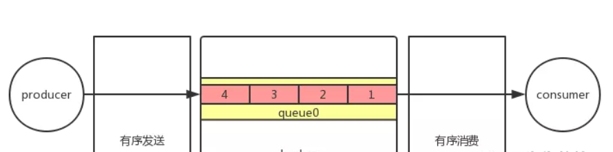
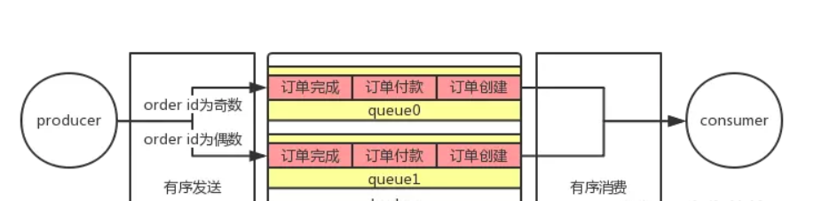
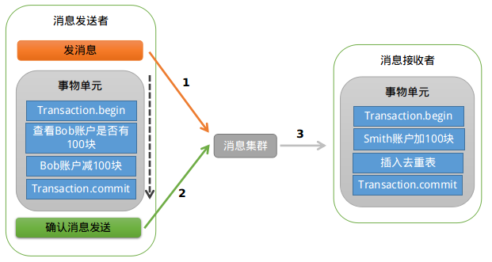

# RocketMQ消息类型

## 普通消息

普通消息也叫做无序消息，简单来说就是没有顺序的消息，producer 只管发送消息，consumer 只管接收消息，至于消息和消息之间的顺序并没有保证，可能先发送的消息先消费，也可能先发送的消息后消费。

举个简单例子，producer 依次发送 order id 为 1、2、3 的消息到 broker，consumer 接到的消息顺序有可能是 1、2、3，也有可能是 2、1、3 等情况，这就是普通消息。

因为不需要保证消息的顺序，所以消息可以大规模并发地发送和消费，吞吐量很高，适合大部分场景。

**代码示例**：

- 生产者

```
public class Producer {
    public static void main(String[] args) throws MQClientException, InterruptedException {

        //声明并初始化一个producer
        //需要一个producer group名字作为构造方法的参数，这里为concurrent_producer
        DefaultMQProducer producer = new DefaultMQProducer("concurrent_producer");

        //设置NameServer地址,此处应改为实际NameServer地址，多个地址之间用；分隔
        //NameServer的地址必须有，但是也可以通过环境变量的方式设置，不一定非得写死在代码里
        producer.setNamesrvAddr("10.1.54.121:9876;10.1.54.122:9876");

        //调用start()方法启动一个producer实例
        producer.start();

        //发送10条消息到Topic为TopicTest，tag为TagA，消息内容为“Hello RocketMQ”拼接上i的值
        for (int i = 0; i < 10; i++) {
            try {
                Message msg = new Message("TopicTestConcurrent",// topic
                        "TagA",// tag
                        ("Hello RocketMQ " + i).getBytes(RemotingHelper.DEFAULT_CHARSET)// body
                );

                //调用producer的send()方法发送消息
                //这里调用的是同步的方式，所以会有返回结果，同时默认发送的也是普通消息
                SendResult sendResult = producer.send(msg);

                //打印返回结果，可以看到消息发送的状态以及一些相关信息
                System.out.println(sendResult);
            } catch (Exception e) {
                e.printStackTrace();
                Thread.sleep(1000);
            }
        }

        //发送完消息之后，调用shutdown()方法关闭producer
        producer.shutdown();
    }
}
```

- 消费者

```
public class Consumer {

    public static void main(String[] args) throws InterruptedException, MQClientException {

        //声明并初始化一个consumer
        //需要一个consumer group名字作为构造方法的参数，这里为concurrent_consumer
        DefaultMQPushConsumer consumer = new DefaultMQPushConsumer("concurrent_consumer");

        //同样也要设置NameServer地址
        consumer.setNamesrvAddr("10.1.54.121:9876;10.1.54.122:9876");

        //这里设置的是一个consumer的消费策略
        //CONSUME_FROM_LAST_OFFSET 默认策略，从该队列最尾开始消费，即跳过历史消息
        //CONSUME_FROM_FIRST_OFFSET 从队列最开始开始消费，即历史消息（还储存在broker的）全部消费一遍
        //CONSUME_FROM_TIMESTAMP 从某个时间点开始消费，和setConsumeTimestamp()配合使用，默认是半个小时以前
        consumer.setConsumeFromWhere(ConsumeFromWhere.CONSUME_FROM_FIRST_OFFSET);

        //设置consumer所订阅的Topic和Tag，*代表全部的Tag
        consumer.subscribe("TopicTestConcurrent", "*");

        //设置一个Listener，主要进行消息的逻辑处理
        //注意这里使用的是MessageListenerConcurrently这个接口
        consumer.registerMessageListener(new MessageListenerConcurrently() {

            @Override
            public ConsumeConcurrentlyStatus consumeMessage(List<MessageExt> msgs,
                                                            ConsumeConcurrentlyContext context) {

                System.out.println(Thread.currentThread().getName() + " Receive New Messages: " + msgs);

                //返回消费状态
                //CONSUME_SUCCESS 消费成功
                //RECONSUME_LATER 消费失败，需要稍后重新消费
                return ConsumeConcurrentlyStatus.CONSUME_SUCCESS;
            }
        });

        //调用start()方法启动consumer
        consumer.start();

        System.out.println("Consumer Started.");
    }
}
```

## 有序消息

有序消息就是按照一定的先后顺序的消息类型。

举个例子来说，producer 依次发送 order id 为 1、2、3 的消息到 broker，consumer 接到的消息顺序也就是 1、2、3 ，而不会出现普通消息那样的 2、1、3 等情况。

那么有序消息是如何保证的呢？我们都知道消息首先由 producer 到 broker，再从 broker 到 consumer，分这两步走。那么要保证消息的有序，势必这两步都是要保证有序的，即要保证消息是按有序发送到 broker，broker 也是有序将消息投递给 consumer，两个条件必须同时满足，缺一不可。
 进一步还可以将有序消息分成

- 全局有序消息
- 局部有序消息

之前我们讲过，topic 只是消息的逻辑分类，内部实现其实是由 queue 组成。当 producer 把消息发送到某个 topic 时，默认是会消息发送到具体的 queue 上。



全局有序

举个例子，producer 发送 order id 为 1、2、3、4 的四条消息到 topicA 上，假设 topicA 的 queue 数为 3 个（queue0、queue1、queue2），那么消息的分布可能就是这种情况，id 为 1 的在 queue0，id 为 2 的在 queue1，id 为 3 的在 queue2，id 为 4 的在 queue0。同样的，consumer 消费时也是按 queue 去消费，这时候就可能出现先消费 1、4，再消费 2、3，和我们的预期不符。那么我们如何实现 1、2、3、4 的消费顺序呢？道理其实很简单，只需要把订单 topic 的 queue 数改为 1，如此一来，只要 producer 按照 1、2、3、4 的顺序去发送消息，那么 consumer 自然也就按照 1、2、3、4 的顺序去消费，这就是全局有序消息。

由于一个 topic 只有一个 queue ，即使我们有多个 producer 实例和 consumer 实例也很难提高消息吞吐量。就好比过独木桥，大家只能一个挨着一个过去，效率低下。

那么有没有吞吐量和有序之间折中的方案呢？其实是有的，就是局部有序消息。



局部有序

我们知道订单消息可以再细分为订单创建、订单付款、订单完成等消息，这些消息都有相同的 order id。同时，也只有按照订单创建、订单付款、订单完成的顺序去消费才符合业务逻辑。但是不同 order id 的消息是可以并行的，不会影响到业务。这时候就常见做法就是将 order id 进行处理，将 order id 相同的消息发送到 topicB 的同一个 queue，假设我们 topicB 有 2 个 queue，那么我们可以简单的对 id 取余，奇数的发往 queue0，偶数的发往 queue1，消费者按照 queue 去消费时，就能保证 queue0 里面的消息有序消费，queue1 里面的消息有序消费。

由于一个 topic 可以有多个 queue，所以在性能比全局有序高得多。假设 queue 数是 n，理论上性能就是全局有序的 n 倍，当然 consumer 也要跟着增加才行。在实际情况中，这种局部有序消息是会比全局有序消息用的更多。

**示例代码**：

- 生产者

```
public class Producer {
    public static void main(String[] args) throws UnsupportedEncodingException {
        try {
            // 声明并初始化一个producer
            // 需要一个producer group名字作为构造方法的参数，这里为ordered_producer
            DefaultMQProducer orderedProducer = new DefaultMQProducer("ordered_producer");

            // 设置NameServer地址,此处应改为实际NameServer地址，多个地址之间用；分隔
            //NameServer的地址必须有，但是也可以通过环境变量的方式设置，不一定非得写死在代码里
            orderedProducer.setNamesrvAddr("10.1.54.121:9876;10.1.54.122:9876");

            // 调用start()方法启动一个producer实例
            orderedProducer.start();

            // 自定义一个tag数组
            String[] tags = new String[]{"TagA", "TagB", "TagC", "TagD", "TagE"};

            // 发送10条消息到Topic为TopicTestOrdered，tag为tags数组按顺序取值，
            // key值为“KEY”拼接上i的值，消息内容为“Hello RocketMQ”拼接上i的值
            for (int i = 0; i < 10; i++) {

                int orderId = i % 10;
                Message msg =
                        new Message("TopicTestOrdered", tags[i % tags.length], "KEY" + i,
                                ("Hello RocketMQ " + i).getBytes(RemotingHelper.DEFAULT_CHARSET));

                SendResult sendResult = orderedProducer.send(msg, new MessageQueueSelector() {

                    // 选择发送消息的队列
                    @Override
                    public MessageQueue select(List<MessageQueue> mqs, Message msg, Object arg) {

                        // arg的值其实就是orderId
                        Integer id = (Integer) arg;

                        // mqs是队列集合，也就是topic所对应的所有队列
                        int index = id % mqs.size();

                        // 这里根据前面的id对队列集合大小求余来返回所对应的队列
                        return mqs.get(index);
                    }
                }, orderId);

                System.out.println(sendResult);
            }

            orderedProducer.shutdown();
        } catch (MQClientException e) {
            e.printStackTrace();
        } catch (RemotingException e) {
            e.printStackTrace();
        } catch (MQBrokerException e) {
            e.printStackTrace();
        } catch (InterruptedException e) {
            e.printStackTrace();
        }
    }
}
```

至于是要实现全局有序，还是局部有序，在此示例代码中，就取决于 TopicTestOrdered 这个 Topic 的队列数了。

- 消费者

```
public class Consumer {

    public static void main(String[] args) throws MQClientException {

        //声明并初始化一个consumer
        //需要一个consumer group名字作为构造方法的参数，这里为concurrent_consumer
        DefaultMQPushConsumer consumer = new DefaultMQPushConsumer("ordered_consumer");

        //同样也要设置NameServer地址
        consumer.setNamesrvAddr("10.1.54.121:9876;10.1.54.122:9876");

        //这里设置的是一个consumer的消费策略
        //CONSUME_FROM_LAST_OFFSET 默认策略，从该队列最尾开始消费，即跳过历史消息
        //CONSUME_FROM_FIRST_OFFSET 从队列最开始开始消费，即历史消息（还储存在broker的）全部消费一遍
        //CONSUME_FROM_TIMESTAMP 从某个时间点开始消费，和setConsumeTimestamp()配合使用，默认是半个小时以前
        consumer.setConsumeFromWhere(ConsumeFromWhere.CONSUME_FROM_FIRST_OFFSET);

        //设置consumer所订阅的Topic和Tag
        consumer.subscribe("TopicTestOrdered", "TagA || TagC || TagD");

        //设置一个Listener，主要进行消息的逻辑处理
        //注意这里使用的是MessageListenerOrderly这个接口
        consumer.registerMessageListener(new MessageListenerOrderly() {

            @Override
            public ConsumeOrderlyStatus consumeMessage(List<MessageExt> msgs, ConsumeOrderlyContext context) {

                System.out.println(Thread.currentThread().getName() + " Receive New Messages: " + msgs);

                //返回消费状态
                //SUCCESS 消费成功
                //SUSPEND_CURRENT_QUEUE_A_MOMENT 消费失败，暂停当前队列的消费
                return ConsumeOrderlyStatus.SUCCESS;
            }
        });

        //调用start()方法启动consumer
        consumer.start();

        System.out.println("Consumer Started.");
    }
}
```

## 延时消息

延时消息，简单来说就是当 producer 将消息发送到 broker 后，会延时一定时间后才投递给 consumer 进行消费。

RcoketMQ的延时等级为：1s，5s，10s，30s，1m，2m，3m，4m，5m，6m，7m，8m，9m，10m，20m，30m，1h，2h。level=0，表示不延时。level=1，表示 1 级延时，对应延时 1s。level=2 表示 2 级延时，对应5s，以此类推。

这种消息一般适用于消息生产和消费之间有时间窗口要求的场景。比如说我们网购时，下单之后是有一个支付时间，超过这个时间未支付，系统就应该自动关闭该笔订单。那么在订单创建的时候就会就需要发送一条延时消息（延时15分钟）后投递给 consumer，consumer 接收消息后再对订单的支付状态进行判断是否关闭订单。

设置延时非常简单，只需要在Message设置对应的延时级别即可：

```
Message msg = new Message("TopicTest",// topic
                        "TagA",// tag
                        ("Hello RocketMQ " + i).getBytes(RemotingHelper.DEFAULT_CHARSET)// body
                );
                // 这里设置需要延时的等级即可
                msg.setDelayTimeLevel(3);
                SendResult sendResult = producer.send(msg);
```

## 事务消息

里说的主要是分布式事物。下面的例子的数据库分别安装在不同的节点上。

事物消费需要先说说什么是事物。比如说：我们跨行转账，从工商银行转到建设银行，也就是我从工商银行扣除1000元之后，我的建设银行也必须加1000元。这样才能保证数据的一致性。假如工商银行转1000元之后，建设银行的服务器突然宕机，那么我扣除了1000，但是并没有在建设银行给我加1000，就出现了数据的不一致。因此加1000和减1000才行，减1000和减1000必须一起成功，一起失败。

再比如，我们进行网购的时候，我们下单之后，订单提交成功，仓库商品的数量必须减一。但是订单可能是一个数据库，仓库数量可能又是在另个数据库里面。有可能订单提交成功之后，仓库数量服务器突然宕机。这样也出现了数据不一致的问题。

使用消息队列来解决分布式事物：

现在我们去外面饭店吃饭，很多时候都不会直接给了钱之后直接在付款的窗口递饭菜，而是付款之后他会给你一张小票，你拿着这个小票去出饭的窗口取饭。这里和我们的系统类似，提高了吞吐量。即使你到第二个窗口，师傅告诉你已经没饭了，你可以拿着这个凭证去退款，即使中途由于出了意外你无法到达窗口进行取饭，但是只要凭证还在，可以将钱退给你。这样就保证了数据的一致性。

如何保证凭证（消息）有2种方法：

1、在工商银行扣款的时候，余额表扣除1000，同时记录日志，而且这2个表是在同一个数据库实例中，可以使用本地事物解决。然后我们通知建设银行需要加1000给该用户，建设银行收到之后给我返回已经加了1000给用户的确认信息之后，我再标记日志表里面的日志为已经完成。

2、通过消息中间件




RocketMQ第一阶段发送Prepared消息时，会拿到消息的地址，第二阶段执行本地事物，第三阶段通过第一阶段拿到的地址去访问消息，并修改消息的状态。

细心的你可能又发现问题了，如果确认消息发送失败了怎么办？RocketMQ会定期扫描消息集群中的事物消息，如果发现了Prepared消息，它会向消息发送端(生产者)确认，Bob的钱到底是减了还是没减呢？如果减了是回滚还是继续发送确认消息呢？RocketMQ会根据发送端设置的策略来决定是回滚还是继续发送确认消息。这样就保证了消息发送与本地事务同时成功或同时失败。

Consumer 端

```java
package transaction;
 
import java.util.List;
 
import com.alibaba.rocketmq.client.consumer.DefaultMQPushConsumer;
import com.alibaba.rocketmq.client.consumer.listener.ConsumeConcurrentlyContext;
import com.alibaba.rocketmq.client.consumer.listener.ConsumeConcurrentlyStatus;
import com.alibaba.rocketmq.client.consumer.listener.MessageListenerConcurrently;
import com.alibaba.rocketmq.client.exception.MQClientException;
import com.alibaba.rocketmq.common.consumer.ConsumeFromWhere;
import com.alibaba.rocketmq.common.message.MessageExt;
 
/**
 * Consumer，订阅消息
 */
public class Consumer {
 
	public static void main(String[] args) throws InterruptedException, MQClientException {
		DefaultMQPushConsumer consumer = new DefaultMQPushConsumer("transaction_Consumer");
		consumer.setNamesrvAddr("192.168.100.145:9876;192.168.100.146:9876;192.168.100.149:9876;192.168.100.239:9876");
		consumer.setConsumeMessageBatchMaxSize(10);
		/**
		 * 设置Consumer第一次启动是从队列头部开始消费还是队列尾部开始消费<br>
		 * 如果非第一次启动，那么按照上次消费的位置继续消费
		 */
		consumer.setConsumeFromWhere(ConsumeFromWhere.CONSUME_FROM_FIRST_OFFSET);
 
		consumer.subscribe("TopicTransactionTest", "*");
 
		consumer.registerMessageListener(new MessageListenerConcurrently() {
 
			public ConsumeConcurrentlyStatus consumeMessage(List<MessageExt> msgs, ConsumeConcurrentlyContext context) {
 
				try {
 
					for (MessageExt msg : msgs) {
						System.out.println(msg + ",内容：" + new String(msg.getBody()));
					}
 
				} catch (Exception e) {
					e.printStackTrace();
 
					return ConsumeConcurrentlyStatus.RECONSUME_LATER;// 重试
 
				}
 
				return ConsumeConcurrentlyStatus.CONSUME_SUCCESS;// 成功
			}
		});
 
		consumer.start();
 
		System.out.println("transaction_Consumer Started.");
	}
}
```

Producer端

```java
package transaction;
 
import com.alibaba.rocketmq.client.exception.MQClientException;
import com.alibaba.rocketmq.client.producer.SendResult;
import com.alibaba.rocketmq.client.producer.TransactionCheckListener;
import com.alibaba.rocketmq.client.producer.TransactionMQProducer;
import com.alibaba.rocketmq.common.message.Message;
 
/**
 * 发送事务消息例子
 * 
 */
public class Producer {
	public static void main(String[] args) throws MQClientException, InterruptedException {
 
		TransactionCheckListener transactionCheckListener = new TransactionCheckListenerImpl();
		TransactionMQProducer producer = new TransactionMQProducer("transaction_Producer");
		producer.setNamesrvAddr("192.168.100.145:9876;192.168.100.146:9876;192.168.100.149:9876;192.168.100.239:9876");
		// 事务回查最小并发数
		producer.setCheckThreadPoolMinSize(2);
		// 事务回查最大并发数
		producer.setCheckThreadPoolMaxSize(2);
		// 队列数
		producer.setCheckRequestHoldMax(2000);
		producer.setTransactionCheckListener(transactionCheckListener);
		producer.start();
 
		// String[] tags = new String[] { "TagA", "TagB", "TagC", "TagD", "TagE"
		// };
		TransactionExecuterImpl tranExecuter = new TransactionExecuterImpl();
		for (int i = 1; i <= 2; i++) {
			try {
				Message msg = new Message("TopicTransactionTest", "transaction" + i, "KEY" + i,
						("Hello RocketMQ " + i).getBytes());
				SendResult sendResult = producer.sendMessageInTransaction(msg, tranExecuter, null);
				System.out.println(sendResult);
 
				Thread.sleep(10);
			} catch (MQClientException e) {
				e.printStackTrace();
			}
		}
 
		for (int i = 0; i < 100000; i++) {
			Thread.sleep(1000);
		}
 
		producer.shutdown();
 
	}
}
```

TransactionExecuterImpl  --执行本地事务

```java
package transaction;
 
import com.alibaba.rocketmq.client.producer.LocalTransactionExecuter;
import com.alibaba.rocketmq.client.producer.LocalTransactionState;
import com.alibaba.rocketmq.common.message.Message;
 
public class TransactionExecuterImpl implements TransactionListener  {

       @Override
       // 执行本地事务
       public LocalTransactionState executeLocalTransaction(Message msg, Object arg) {
           	System.out.println("执行本地事务msg = " + new String(msg.getBody()));
            System.out.println("执行本地事务arg = " + arg);

            String tags = msg.getTags();

            if (tags.equals("transaction2")) {
                System.out.println("======我的操作============，失败了  -进行ROLLBACK");
                return LocalTransactionState.ROLLBACK_MESSAGE;
            }
            return LocalTransactionState.COMMIT_MESSAGE;
       }
   
       @Override
       //在这里，我们可以根据由MQ回传的key去数据库查询，这条数据到底是成功了还是失败了。
       public LocalTransactionState checkLocalTransaction(MessageExt msg) {
           System.out.println("未决事务，服务器回查客户端msg =" + new String(msg.getBody().toString()));
		   // return LocalTransactionState.ROLLBACK_MESSAGE;
		   return LocalTransactionState.COMMIT_MESSAGE;
       }
}
```

